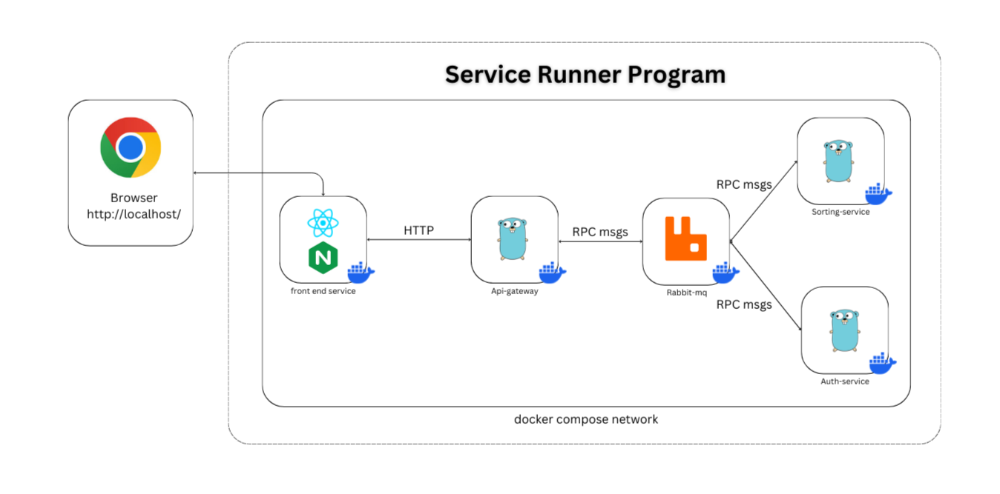
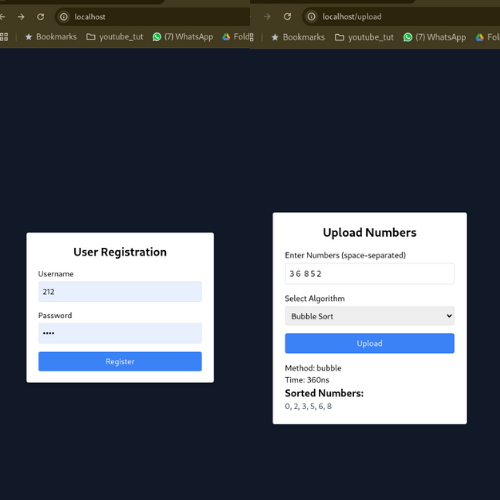

# How to run

### Required - Docker installed

1. make a directory anyhere in your computer.
2. clone all the services in to that directory.

```
1. Frontend - git clone https://github.com/KMjanith/SR-frontend.git
```

```
2. Athentication service - git clone https://github.com/KMjanith/SR-auth-service.git
```

```
3. Api-gateway service - git clone https://github.com/KMjanith/SR-ai-gateway.git
```

```
4. Sorting-service - git clone https://github.com/KMjanith/SR-sorting-service.git
```

```
5. service-runner - git clone https://github.com/KMjanith/SR-service-runner.git
```

3. visit [Medium article](https://medium.com/@kavinduj.20/manage-miroservices-centrally-using-docker-compose-in-both-windows-and-linux-78e61753d284) to see how this works.
4. Navigate to the `SR-service-runner`

</br>

# Development environement

5. use follow code to run all the services.

```
./devStart.sh
```

6. do code changes and see from the logs .

```
doker ps                        # to get the running containers
docker logs -f <container-id>   # to see live logs
```

7. If you have done any change to the front end make sure to run the service runner using following command.

```
./devStart.sh build
```

8. visit `http://localhost/` to access the front end.
9. Use `./devStop.sh` to stop the services
10. Equalantly you can use `.bat` files for windows. for that you need to up the docker desktop

## Entire service architecture

#### This microservice application is use only to demonstrate the functionality of the this `service-runner` service. Hence do not consider the logic used in the individual service.



#### After succcefull registration user direct to the soriting page. There users can input comma seperated integers and choose the method to sort. Then sorting service will sort the input and calculate the time taken to sort. Then output will display as follow.

</br>
</br>



</br>

# production environment

#### Here major diference is services are runing using Pre build docker images. Here the `runner.py` file is called by the `./prodStart.sh` command. Then it will do a little web scraping and get the latest image of the relavant services. After that services will spin up

1. run

```
./prodStart.sh
```

2. see the latest tags of the services

## How tags automatically genarated

#### Every service has a github action workflow configured. When changes push to the main branch the action will trigger and it gets the current latest tag from the docker hub. Then it will create a new next tag and push to docker hub.
